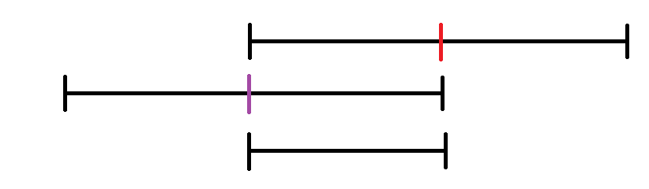

# Misc/Subtraction
**Writeup Author:** lufimio
**Original Solver:** lufimio
**Point Value:** 448

**Provided Files:**
  - ['server.py'](https://static.n00bzunit3d.xyz/Misc/Subtraction/server.py)
  - you could create an instance which gave you a netcat server

**Description:**
My little brother is learning math, can you show him how to do some subtraction problems? Author: Connor Chang

# Solution

before i start creating the solve script i decided to look through the server and understand what it does

looking at `server.py` we find that it generates a list of n, which is set to 696969, random integers 
and we get 20 chances to subtract a number from each and every element in the list so that the number of unique elements in the list is equal to 1, and since there's an absolue value there all the numbers are always positive

now we start creating the solve script, im using pwntools as i am very familiar with it

for easy debugging i create a local process over connecting to the server and i parse the list by splitting the output between each space
`a = list(map(int, p.recvline().decode().split()))`

ok now that we have the list, we have to cut the range of the list so it goes to 1 as fast as possible

to do this we can take the average of the max and min of the list, and make that average even to keep the math simple, and do that 17 times this should cut the range down to 4 every time

to illustrate this, look at the image below the red line is the average of the max and min and if we shift the number line left by the average and and then perform the absolute value, where purple is 0, we see that we've cut the range in half


cutting the range in half 17 times would, on average reduce the range down to at least 5.317 however since were sticking to even numbers, solely for this next step, we will have 4 unique elements: {0, 2, 4, 6}

then the solution is trivial, we can subtract 3 from every element to get {1, 3}

and then subtract 1 twice to get {0, 2} and then finally {1} to solve it

now to convert that math to a script, we just calculate the value to subtract, simple python, and then calculate the changes locally and also send the value to the program
```py
val = (min(a) + max(a)) // 2
val -= val % 2

a = [abs(val - x) for x in a]
print(len(set(a)))
if len(set(a)) < 10: print(set(a)) 

p.sendline(str(val).encode())
```

repeat that 17 times and then just add 
```py
val = 3
a = [abs(val - x) for x in a]
print(len(set(a)))
if len(set(a)) < 10: print(set(a)) 

p.sendline(str(val).encode())
```
with the appropriate `val` (3, 1, and then 1)

we then make the process interactive so we can read the flag

running this on the server by changing `p = process(['python3', 'server.py'])` to `p = remote(host, port)` gets us the flag: `n00bz{1_sh0uld_t34ch_my_br0th3r_logs_a70d142ce03a}`